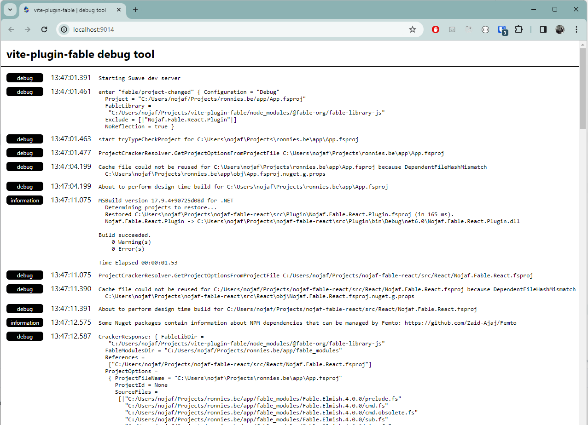

# Debugging

This plugin is a wonderful piece until it no longer works. Then it just sucks, and who knows where in the rabbit hole the problem lies.  
The biggest fear this plugin can face is when the dotnet process no longer responds.
Even if it is not able to process the incoming request, it should always be able to produce a response.

## Debug viewer

In order to find out what happened in the dotnet world, you can set the `VITE_PLUGIN_FABLE_DEBUG` environment variable before running Vite.

```bash
# bash
export VITE_PLUGIN_FABLE_DEBUG=1
```

```pwsh
# PowerShell
$env:VITE_PLUGIN_FABLE_DEBUG=1
```

When running Vite, you should see something like this in the Vite output:

```shell
Running daemon in debug mode, visit http://localhost:9014 to view logs
```

Opening [http://localhost:9014](http://localhost:9014) will display a list of log messages that happened inside the dotnet process:



It should receive new log messages via web sockets after the initial page load.

[Next]({{fsdocs-next-page-link}})
